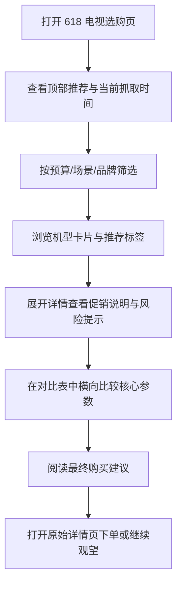

## 1. 产品概述
面向 618 大促期 75 寸电视选购场景，做一个本地可离线打开的单页 HTML，集中展示当前抓取到的价格、核心参数和明确购买建议。
- 解决“爆料很多但信息碎、价格口径乱、参数难对比”的问题，帮助用户快速锁定适合自己的机型。
- 目标价值是把“搜索页 + 详情页 + 参数判断”整合成一页可筛选、可比较、可直接决策的选购面板。

## 2. 核心功能

### 2.1 功能模块
1. **选购首页**：价格总览、推荐结论、筛选区、机型卡片区、对比表区。

### 2.2 页面详情
| 页面名称 | 模块名称 | 功能描述 |
|-----------|-------------|---------------------|
| 选购首页 | 顶部概览 | 展示抓取时间、样本数、当前最推荐机型、最低价 Mini LED、一步到位推荐 |
| 选购首页 | 快速结论区 | 直接给出“默认推荐 / 预算优先 / 画质优先 / 高端优先 / 不建议盲买” |
| 选购首页 | 智能筛选区 | 按预算、背光类型、使用场景、品牌、推荐等级、是否当前好价筛选 |
| 选购首页 | 机型卡片区 | 每张卡展示机型名、当前价格、价格状态、核心参数、推荐标签、简短优缺点 |
| 选购首页 | 详情抽屉/展开区 | 展示促销说明、详情页链接、参数摘要、风险提示 |
| 选购首页 | 对比表区 | 将筛选后的机型以表格形式横向对比价格、分区、亮度、刷新率、接口、内存 |
| 选购首页 | 价格洞察区 | 展示同型号多条爆料价，区分“当前页最低价”和“历史抓取价” |
| 选购首页 | 购买建议区 | 按预算段和场景给出结论，如“2000-2500”“3000-3500”“强光客厅”“主机游戏” |
| 选购首页 | 数据说明区 | 说明数据来源、价格口径、国补限制、命名映射风险 |

## 3. 核心流程
用户打开页面后，先看到一句话结论和当前好价摘要，再通过预算或场景筛选收窄候选机型；对感兴趣的机型查看卡片详情和促销说明，最后在对比表中做横向确认并形成购买决策。

## 4. 用户界面设计
### 4.1 设计风格
- 主色：深石墨黑、奶油白、荧光酸橙、少量警示橙
- 按钮风格：硬边卡片 + 轻微玻璃感高亮，主按钮为荧光描边
- 字体：标题使用具有电商海报感的中文展示字体，正文字体使用清晰易读的中文无衬线
- 布局风格：桌面优先的信息密集型选购面板，顶部概览 + 左侧筛选 + 右侧内容流
- 图标风格：简洁几何图标 + 数字标签，不使用花哨插画

### 4.2 页面设计概览
| 页面名称 | 模块名称 | UI 元素 |
|-----------|-------------|-------------|
| 选购首页 | 顶部概览 | 大号价格标签、数据更新时间、推荐徽章、渐变背景、数字翻牌感 |
| 选购首页 | 快速结论区 | 4-5 个强结论卡片、醒目色条、推荐理由短句 |
| 选购首页 | 智能筛选区 | 分段按钮、价格滑块风格控件、标签选择器、清空按钮 |
| 选购首页 | 机型卡片区 | 卡片网格、价格角标、参数芯片、展开动画、当前好价标识 |
| 选购首页 | 对比表区 | 粘性表头、行高亮、推荐机型突出、颜色编码差异 |
| 选购首页 | 数据说明区 | 折叠说明、来源链接、风险提示、采集备注 |

### 4.3 响应式
- 默认桌面优先，适合在大屏或笔记本中查看大量参数
- 平板下改为上下布局，筛选区折叠到顶部
- 手机端保证可读，但主目标仍是桌面高密度浏览

