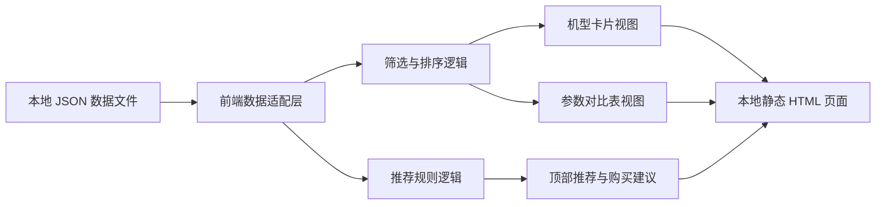
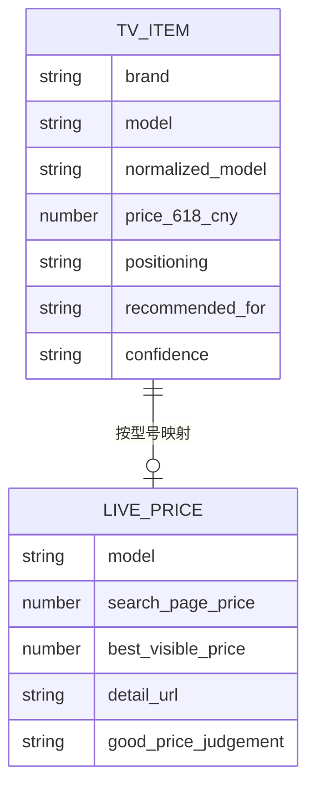

## 1. 架构设计
本页面采用纯前端静态架构，以本地 JSON 数据为源，使用单文件 HTML + CSS + JavaScript 渲染页面，避免额外服务依赖，便于离线打开与后续继续补数据。

## 2. 技术描述
- 前端：原生 HTML5 + CSS3 + Vanilla JavaScript
- 数据源：`shopping-research/tv_618_2026/tv_75inch_618_db.json` 与 `shopping-research/tv_618_2026/tv_75inch_618_live_prices.json`
- 渲染方式：页面启动后读取内嵌数据或同目录 JSON 数据，合并后渲染
- 样式策略：CSS 变量 + 组件化 class 命名，避免引入构建工具
- 交互策略：原生事件监听、状态对象、客户端筛选和排序

## 3. 路由定义
| 路由 | 用途 |
|-------|---------|
| /shopping-research/tv_618_2026/tv_75inch_618_buying_guide.html | 618 75 寸电视本地选购页 |

## 4. 数据定义
### 4.1 数据模型定义

### 4.2 字段使用约定
| 字段 | 用途 |
|------|------|
| `price_618_cny` | 机型基准价，用于主排序与价格带分桶 |
| `best_visible_price` | 当前浏览器抓到的更实时页面价，优先展示 |
| `panel_or_backlight` | 展示普通液晶、Mini LED、QD-Mini LED 等背光类别 |
| `local_dimming_zones` | 体现控光能力，缺失时以 `-` 展示 |
| `peak_brightness_nits` | 体现亮度上限，缺失时不参与强比较 |
| `native_refresh_hz` / `high_refresh_mode_hz` | 区分原生刷新率和宣传模式高刷 |
| `good_price_judgement` | 作为“当前值得买”筛选条件 |
| `warnings` | 用于风险提示与命名映射说明 |

## 5. 页面模块实现
| 模块 | 实现方式 |
|------|----------|
| 顶部概览 | 初始化时从合并后的数据集中计算最低价、默认推荐、最佳 Mini LED |
| 筛选区 | 使用下拉、标签按钮、区间按钮驱动统一状态对象 |
| 卡片区 | 根据筛选结果动态生成 DOM，展示价格、标签、参数摘要 |
| 对比表 | 复用同一份筛选结果，按列输出核心参数 |
| 价格洞察 | 若同型号存在多条价格，展示最低可见价和其他可见价 |
| 建议区 | 使用预设规则和推荐标签生成结论卡片 |

## 6. 排序与推荐规则
- 默认排序：推荐等级优先，其次按当前可见最低价升序
- 推荐优先级：`默认推荐` > `预算优先` > `画质优先` > `高端一步到位`
- 价格展示优先级：`best_visible_price` > `search_page_price` > `price_618_cny`
- 风险提示规则：若存在 `warnings` 或价格评论中提到“无货/做不到该价”，则在卡片中提示“需核库存/资格”

## 7. 性能与可维护性
- 页面为单文件，目标首屏秒开，不依赖外部框架
- 数据与页面分离，后续仅更新 JSON 即可刷新内容
- 所有样式通过 CSS 变量集中控制，便于切换主题
- 保留可扩展接口，后续可增加 `85 寸`、`海信/Vidda` 等更多机型

