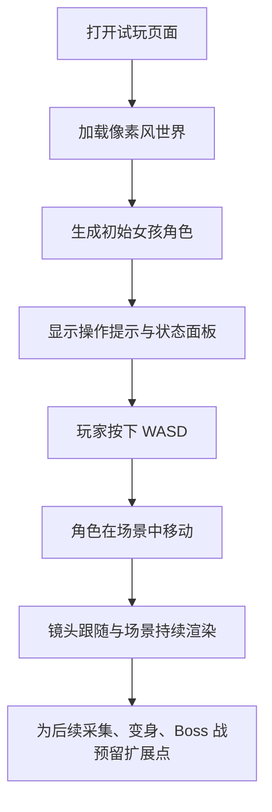

## 1. 产品概述
这是一个可直接在浏览器里打开的 2D 俯视角生存试玩版，核心体验是“在像素化世界中移动、收集、成长，并在任意时刻挑战最终 Boss”。
- 目标用户是想快速验证玩法感觉与美术方向的创作者本人，当前阶段优先做出可试玩、可继续扩展的 HTML 原型。
- 产品价值是先把世界观、美术语言、移动手感和主角形象搭起来，为后续加入每日随机变身、采集成长与 Boss 战打基础。

## 2. 核心功能

### 2.1 功能模块
1. **试玩主页面**：进入游戏、查看当前状态、直接开始操作。
2. **游戏场景模块**：生成俯视角 2D 世界地表、障碍、可探索区域与像素风环境细节。
3. **角色模块**：初始角色为女孩，具备基础待机与移动朝向表现。
4. **控制模块**：支持 `W` `A` `S` `D` 四方向移动，具备稳定的位移与视口跟随。
5. **原型信息面板**：展示当前阶段调试信息，如坐标、移动速度、后续能力槽位预留。

### 2.2 页面详情
| 页面名称 | 模块名称 | 功能说明 |
|-----------|-------------|---------------------|
| 试玩主页面 | 游戏画布 | 承载整个俯视角地图、角色、地块与后续战斗元素 |
| 试玩主页面 | 顶部信息栏 | 显示游戏名、当前阶段、操作提示、试玩目标 |
| 试玩主页面 | 状态卡片 | 显示角色名称、当前形态、生命值占位、挑战 Boss 提示占位 |
| 试玩主页面 | 场景系统 | 基于程序化规则生成草地、土块、水域、石块等像素地形 |
| 试玩主页面 | 主角系统 | 渲染女孩角色、朝向切换、移动动画节奏 |
| 试玩主页面 | 输入控制 | 监听键盘输入，实现 8 向移动中的 4 键控制与平滑位移 |

## 3. 核心流程
用户打开页面后直接进入试玩场景，看到一个像素风世界与初始女孩主角。用户通过 `WASD` 探索场景，感受移动、地图风格与空间布局。当前版本不加入战斗与变身逻辑，但会在界面上保留后续系统占位，方便下一阶段接入采集、成长与 Boss 挑战。

## 4. 用户界面设计
### 4.1 设计风格
- 主风格：类《我的世界》灵感的低分辨率像素块面，强调方块、重复纹理与清晰轮廓。
- 主色：草地绿、泥土棕、石块灰、水域蓝；辅色使用暖黄和粉色，突出女孩主角与 HUD。
- 按钮风格：像素边框、深色描边、轻微按压阴影，统一使用块状圆角而非现代扁平按钮。
- 字体风格：标题使用有像素感或复古游戏感字体，正文使用清晰易读的无衬线字体。
- 布局风格：桌面优先，大画布居中，信息面板悬浮在四周，不遮挡核心移动区域。
- 图标建议：尽量使用像素绘制的小图标或纯色方块标识，不使用写实图标。

### 4.2 页面设计概览
| 页面名称 | 模块名称 | UI 元素 |
|-----------|-------------|-------------|
| 试玩主页面 | 顶部信息栏 | 深色半透明条、像素标题、当前版本标签、操作说明 |
| 试玩主页面 | 游戏画布 | 俯视角网格地图、块状地形、角色阴影、边缘柔和暗角 |
| 试玩主页面 | 状态卡片 | 像素面板、标签分区、形态占位、Boss 提示占位 |
| 试玩主页面 | 调试信息 | 小型半透明卡片，显示位置、速度、世界种子等 |

### 4.3 响应式策略
- 采用桌面优先设计，优先保证键盘操作与大画布体验。
- 在较窄屏幕下自动缩放画布与 HUD，但首版不以移动端触控为重点。
- 预留后续加入触控摇杆与虚拟按键的空间。

## 5. 阶段范围
### 5.1 本次必须完成
- 生成一个具有像素块风格的 2D 世界。
- 实现女孩主角的基础形象与渲染。
- 支持 `WASD` 控制上下左右移动。
- 让页面可以直接作为单个 HTML 试玩。

### 5.2 本次只做占位，不做完整逻辑
- 每日随机变身系统。
- 收集资源增强自身。
- 主动挑战最终 Boss。
- 战斗、技能释放、敌人 AI、掉落与成长树。

### 5.3 后续扩展方向
- 每日随机形态池与技能差异。
- 资源采集与成长属性。
- 地图内刷怪与生存压力。
- 最终 Boss 入口、阶段战与胜利结算。
