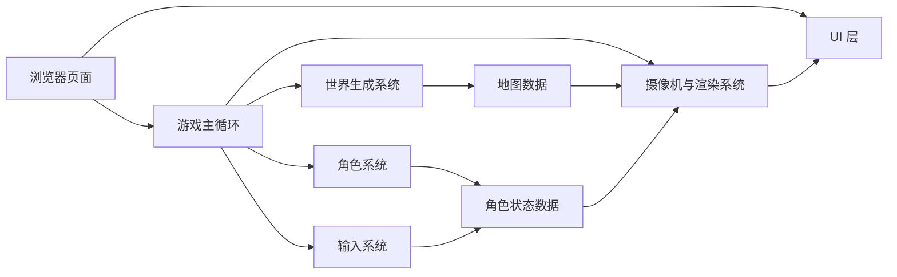

## 1. 架构设计
当前试玩版采用纯前端单页架构，不依赖后端服务。所有地图生成、角色更新、输入处理与渲染逻辑都在浏览器内完成，便于直接打开 `index.html` 试玩与后续快速迭代。



## 2. 技术说明
- 前端：原生 `HTML` + `CSS` + `JavaScript`
- 渲染方式：`Canvas 2D`
- 组织方式：单 HTML 文件内联样式与脚本，确保可直接双击打开试玩
- 目录位置：`/Users/bytedance/Documents/Projects/life_skills/html_demo/daily_morph_survivor/`
- 入口文件：`index.html`

选择原生 HTML 的原因：
- 用户明确希望先得到可直接测试的 HTML 版本。
- 当前阶段只有一个试玩页面，原生实现更轻、更快、更容易直接发布到 GitHub Pages。
- 地图生成与角色移动逻辑用 `Canvas` 即可满足，不需要引入额外框架。

## 3. 模块划分
| 模块 | 职责 |
|-------|---------|
| 页面外壳模块 | 创建 HUD、说明栏、状态面板与画布容器 |
| 世界生成模块 | 生成固定尺寸的地块网格，为每个格子分配草地、泥土、水、石头等地形类型 |
| 渲染模块 | 按网格绘制地图纹理、角色、阴影、边界与轻量环境装饰 |
| 角色模块 | 保存女孩主角的坐标、速度、朝向、移动状态与后续扩展能力槽位 |
| 输入模块 | 监听 `keydown` / `keyup`，维护 `WASD` 按键状态 |
| 游戏循环模块 | 用 `requestAnimationFrame` 更新角色位置、相机偏移与整帧重绘 |
| 调试信息模块 | 输出坐标、速度、地块信息与世界种子，便于后续调试 |

## 4. 路由定义
| 路由 | 用途 |
|-------|---------|
| `/html_demo/daily_morph_survivor/` | 打开试玩版主页面 |

## 5. 数据模型
### 5.1 世界数据
```js
{
  tileSize: 32,
  width: 64,
  height: 64,
  seed: "daily-morph-alpha",
  tiles: [
    { x: 0, y: 0, type: "grass", walkable: true },
    { x: 1, y: 0, type: "water", walkable: false }
  ]
}
```

### 5.2 角色数据
```js
{
  id: "hero_girl",
  form: "girl",
  position: { x: 12, y: 12 },
  velocity: { x: 0, y: 0 },
  speed: 3.2,
  facing: "down",
  hp: 100,
  attack: 8,
  inventory: [],
  unlockedForms: []
}
```

### 5.3 后续扩展数据预留
```js
{
  dailyFormPool: [],
  gatheredResources: {},
  bossGateUnlocked: false,
  skillSlots: []
}
```

## 6. 核心实现策略
### 6.1 世界生成
- 使用伪随机算法生成二维网格地图。
- 通过噪声感分布或规则分区混合草地、水域、石块、土块，避免纯随机造成碎片感过强。
- 首版优先做“看起来像世界”的地表层，不做复杂碰撞与生态系统。

### 6.2 角色表现
- 主角默认是女孩，使用像素块拼出头发、脸部、裙装或上衣下装。
- 通过朝向切换改变角色正面、背面、左右面的块状细节。
- 移动时增加轻微上下浮动或腿部块变化，形成基础移动感。

### 6.3 移动与相机
- `WASD` 改变目标速度向量，按帧更新位置。
- 对斜向速度做归一化预留，但首版键位说明仍以四方向为主。
- 相机跟随角色，使主角基本保持在画布中心区域。
- 碰撞先只处理不可行走地块，如水域和大石块。

### 6.4 视觉风格
- 参考《我的世界》的方块感，但不用直接复刻。
- 使用更柔和的女孩主角配色，让角色在地表中有明显辨识度。
- 整体采用高对比描边、像素纹理重复、少量环境装饰点缀。

## 7. 性能与兼容性
- 地图渲染以视口裁剪为主，只绘制相机附近区域，避免整图每帧全量绘制。
- 所有资源采用代码生成，不依赖外部图片，降低加载成本。
- 目标运行环境为现代桌面浏览器，优先兼容 `Chrome` / `Edge` / `Safari`。

## 8. 分阶段交付
### 8.1 第一阶段
- 建立单文件 HTML 试玩框架。
- 完成地图生成、女孩角色、`WASD` 移动与相机跟随。

### 8.2 第二阶段
- 加入资源采集、成长数值与每日随机变身。

### 8.3 第三阶段
- 加入最终 Boss 区域、挑战入口与基础战斗。
