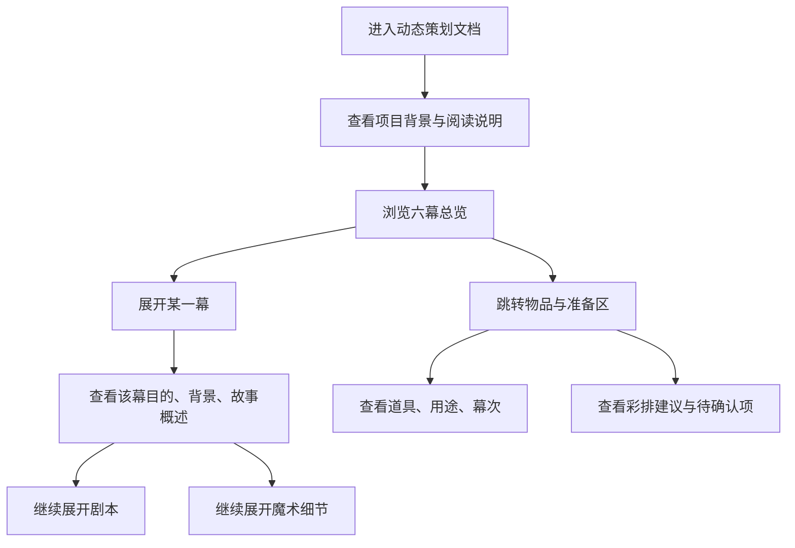

## 1. 产品概述
这是一个用于呈现“幼儿园毕业典礼哈利波特主题亲子魔术节目策划案”的单页动态 HTML 文档。它服务于方案 review、活动筹备和现场彩排，让阅读者能按层级逐步展开内容，而不是一次看到整篇长文。

- 核心目标是把静态策划稿转换成便于理解、便于讨论、便于执行的动态阅读体验
- 主要用户是方案 review 人、家长、老师，以及后续参与排练和准备物料的人
- 文档价值在于降低信息负担，让不同角色可以快速看到“先看整体，再看分幕，再看剧本和魔术细节”的层级结构

## 2. 核心功能

### 2.1 功能模块
1. **总览首页**：展示项目背景、阅读方式、六幕总导航
2. **六幕结构区**：默认按六幕展示，每一幕可单独展开和收起
3. **分幕详情区**：每一幕内展示目的、背景、故事概述、剧本、相关魔术细节
4. **物品与准备区**：单独罗列道具、用途、对应幕次、彩排与待确认事项

### 2.2 页面明细
| 页面名称 | 模块名称 | 功能说明 |
|-----------|-------------|---------------------|
| 单页动态策划文档 | 顶部概览区 | 展示标题、项目定位、阅读说明、快速跳转入口 |
| 单页动态策划文档 | 六幕导航区 | 用 6 个幕次卡片或折叠标题作为默认入口 |
| 单页动态策划文档 | 分幕折叠区 | 每一幕支持展开/收起，按层级展示摘要与细节 |
| 单页动态策划文档 | 剧本展示区 | 在对应幕次下显示人物台词和动作说明 |
| 单页动态策划文档 | 魔术细节区 | 若该幕包含魔术，则显示原理、分工、执行提醒 |
| 单页动态策划文档 | 道具区 | 以清单或表格方式展示道具、用途、幕次 |
| 单页动态策划文档 | 辅助信息区 | 展示彩排建议、待确认项和后续补充 |

## 3. 核心流程
用户打开页面后，先看到项目背景和六幕总览，再按幕次逐层展开内容。若只想看整体结构，可以停留在六幕级别；若要 review 细节，就继续点开剧本和魔术说明；若要准备执行，就去看道具和准备事项。

## 4. 用户界面设计
### 4.1 设计风格
- 整体风格：带一点魔法氛围的舞台策划文档，不做儿童化卡通，也不做过于花哨的主题页
- 主色：深墨蓝、暖金色、羊皮纸米白
- 按钮和交互：折叠标题、分幕卡片、轻微悬停反馈、平滑展开动画
- 字体建议：中文用更有书卷感但仍清晰易读的字体组合，标题与正文有明确层级
- 布局风格：桌面优先，顶部总览 + 主内容分区 + 右侧或顶部快速导航
- 图标风格：少量魔杖、星光、卷轴等装饰性符号，控制密度

### 4.2 页面设计概览
| 页面名称 | 模块名称 | UI 元素 |
|-----------|-------------|-------------|
| 单页动态策划文档 | 顶部概览区 | 大标题、项目一句话说明、阅读提示、快速入口按钮 |
| 单页动态策划文档 | 六幕导航区 | 六张幕次卡片或可折叠标题，带状态提示 |
| 单页动态策划文档 | 分幕详情区 | 折叠容器、分层标题、摘要卡片、剧本块、魔术说明块 |
| 单页动态策划文档 | 物品与准备区 | 表格、清单、标签、辅助说明 |
| 单页动态策划文档 | 页面背景 | 深色渐变、轻微纹理、柔和高光、舞台感层次 |

### 4.3 响应式设计
- 采用桌面优先设计
- 桌面端突出分区与层级导航
- 平板和移动端保留折叠结构，改为单列布局
- 所有折叠和跳转操作都兼容触屏点击
