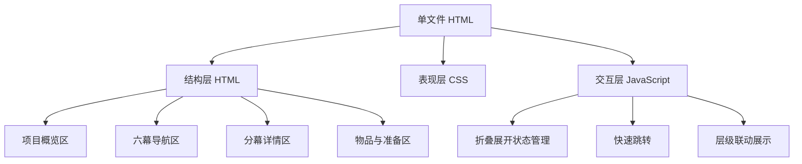

## 1. 架构设计
本方案采用单文件静态前端实现，直接输出一个可本地打开的 HTML 文档。页面内包含结构化数据、样式系统和少量原生 JavaScript 交互逻辑，用于控制折叠展开、快速跳转和阅读状态。



## 2. 技术说明
- 前端：原生 HTML5 + CSS3 + JavaScript
- 交互方式：基于 `details/summary` 与补充脚本增强，或原生按钮 + 数据属性控制展开状态
- 数据组织：在页面内以结构化 JavaScript 对象维护六幕、剧本、魔术、道具与准备信息
- 输出形式：单个 `.html` 文件，可直接在浏览器打开

## 3. 路由定义
| 路由 | 用途 |
|-------|---------|
| 单页 HTML，无路由 | 直接承载整个动态策划文档 |

## 4. 模块定义
| 模块 | 职责 |
|------|------|
| 概览模块 | 呈现项目背景、阅读说明、总入口 |
| 六幕导航模块 | 以六幕为默认视图入口，支持快速定位 |
| 分幕内容模块 | 展示每一幕的目的、背景、故事概述 |
| 剧本模块 | 展示该幕下的人物台词和动作 |
| 魔术模块 | 在对应幕次中展示相关魔术细节 |
| 道具与准备模块 | 展示物品、用途、幕次、彩排建议、待确认项 |
| 交互控制模块 | 控制展开收起、默认展开层级、平滑滚动与高亮 |

## 5. 数据模型
### 5.1 数据结构定义
```ts
type ScriptBlock = {
  speaker: string;
  text: string;
  type?: "dialogue" | "action";
};

type MagicDetail = {
  name: string;
  effect: string;
  implementation: string;
  roles: string[];
  tips: string[];
};

type Scene = {
  id: string;
  title: string;
  purpose: string[];
  background: string;
  summary: string;
  script: ScriptBlock[];
  magicRefs: string[];
};

type PropItem = {
  name: string;
  usage: string;
  scene: string;
};
```

### 5.2 页面组织规则
- 第一层：六幕总览
- 第二层：单幕摘要信息，包括目的、背景、故事概述
- 第三层：剧本与魔术细节分开折叠
- 平行区：道具、彩排建议、待确认项独立展示，不混在六幕结构中

## 6. 交互与实现约束
- 默认展示六幕入口，不默认把所有细节全部展开
- 每一幕都应支持独立展开和收起
- 每一幕内优先先展示“这一幕讲什么”，再展示剧本，再展示相关魔术细节
- 若某一幕没有魔术，则不展示空白魔术块
- 道具与准备信息单独成区，支持表格或清单阅读
- 页面应适合本地交付和分享，不依赖构建工具或后端服务
- 动画要轻，不影响文档阅读效率
