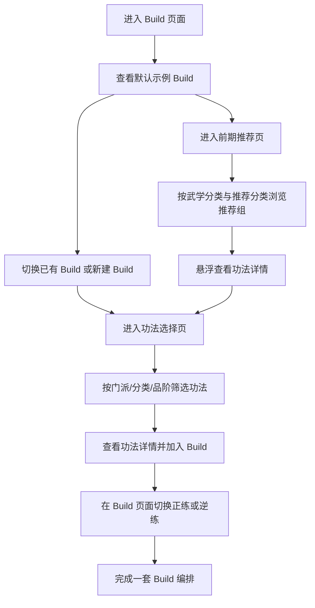

## 1. 产品概述
这是一个面向《太吾绘卷》玩家的本地交互式 Build 搭配器，用来整理、筛选、组合功法，并以接近游戏内功法编排界面的方式展示搭配结果。
- 核心目标是把现有功法主库与“前期功法推荐”数据转成可交互的可视化工具，帮助用户理解 Build 结构，而不是只看静态 wiki 文本。
- 产品价值在于把“功法检索”“推荐理解”“Build 组合管理”合并到同一工具中，降低查表和脑内整理成本。

## 2. 核心功能

### 2.1 用户角色
本产品为单人本地工具，无需区分角色。

### 2.2 功能模块
1. **Build 页面**：左侧切换或新建 Build，右侧配置当前 Build 的功法、正逆练、说明和结构分布。
2. **前期推荐页**：以结构化卡片方式展示前期推荐功法，支持按武学分类和推荐分类浏览。
3. **功法选择页**：从 Build 页面进入，用于筛选、搜索并选择所有功法。

### 2.3 页面详情
| 页面名称 | 模块名称 | 功能说明 |
|-----------|-------------|---------------------|
| Build 页面 | Build 列表侧栏 | 展示已有 Build，支持新建、重命名、切换示例 Build |
| Build 页面 | Build 总览头部 | 展示当前 Build 名称、定位标签、概述文案、入口按钮 |
| Build 页面 | 五大栏位编排区 | 按内功、摧破、轻灵、护体、奇窍分区展示已选择功法 |
| Build 页面 | 功法卡片 | 展示功法名称、门派、品阶、内力路线、正逆练状态、简述 |
| Build 页面 | 编辑操作区 | 为每个栏位新增/替换/移除功法，并切换正练或逆练 |
| Build 页面 | 推荐入口 | 跳转前期推荐页，或在侧边/弹层中查看推荐 Build 灵感 |
| 前期推荐页 | 分类导航 | 按武学分类（内功/摧破等）与推荐分类（通用类/直伤类等）切换 |
| 前期推荐页 | 推荐组卡片 | 展示推荐分类、涉及功法列表、推荐理由、相关说明 |
| 前期推荐页 | 功法悬浮详情 | 鼠标悬浮功法名时展示仿 wiki 的详情浮层 |
| 功法选择页 | 检索工具栏 | 按名称、门派、武学分类、品阶、内力路线、正逆练适配进行筛选 |
| 功法选择页 | 功法结果网格 | 展示所有功法卡片，支持悬浮详情、查看理由、加入当前 Build |
| 功法选择页 | 当前选择预览 | 展示当前准备加入 Build 的功法及目标栏位 |

## 3. 核心流程
用户进入 Build 页面后，可先查看默认示例“刀剑乱舞 Build”，理解一套偏刀剑联动、持续摧破输出的示例思路。随后用户可切换已有 Build 或新建 Build，在五大功法栏位中分别选择功法、设置正练/逆练，并随时通过功法选择页补充或替换功法。若用户想理解前期推荐体系，可从 Build 页面进入前期推荐页，按分类查看推荐组，并将推荐功法作为 Build 候选。整个过程保持数据本地化，无需后端。

## 4. 用户界面设计
### 4.1 设计风格
- 主色：深棕黑、乌金、暗铜、冷青灰，贴近游戏内 UI 氛围
- 强调色：内力五行色与功法类型色点缀，用于功法标签与图标状态
- 按钮样式：仿游戏边框按钮，带轻微浮雕、内阴影和高亮描边
- 字体：标题使用有武侠感的衬线中文标题字体，正文使用易读的中文 UI 字体
- 布局风格：桌面优先，左侧导航 + 右侧主操作区，卡槽式功法编排布局
- 图标风格：仿游戏内功法图标视觉语言，结合已有功法颜色与类别信息

### 4.2 页面设计概览
| 页面名称 | 模块名称 | UI 元素 |
|-----------|-------------|-------------|
| Build 页面 | Build 侧栏 | 深色面板、列表切换、高亮当前 Build、加号新建按钮 |
| Build 页面 | 功法编排区 | 仿游戏卡槽网格、分区标题、功法徽章、空槽占位符 |
| Build 页面 | 示例 Build 展示 | 默认展示“刀剑乱舞 Build”，带 Build 定位、玩法说明、关键联动 |
| 前期推荐页 | 分类导航 | 顶部粘性分类条、左右分栏或双层 tab |
| 前期推荐页 | 推荐组卡片 | 成组功法 chip、理由说明卡、引用式解释块 |
| 前期推荐页 | Tooltip 浮层 | 仿 wiki 黑底浮层，展示门派、品阶、路线、正逆练效果 |
| 功法选择页 | 筛选区 | 多条件过滤器、关键字搜索、可折叠筛选面板 |
| 功法选择页 | 功法卡片墙 | 高密度卡片、状态标签、加入 Build 操作按钮 |

### 4.3 响应式
- 采用桌面优先设计，优先覆盖宽屏和常见笔记本分辨率
- 在窄屏下退化为上下结构，但首版以桌面交互完整性为主
- Tooltip、筛选浮层和选择页在窄屏下改为抽屉或全屏面板

### 4.4 视觉与氛围指引
- 整体观感要明显向《太吾绘卷》功法编排界面靠拢，但不直接照搬
- 页面背景使用低对比纹理、暗色渐变与微光粒子，避免纯平 Web 风格
- Build 编排区强调“像在排功法盘”，让玩家一眼能理解每套 Build 的结构
- 示例 Build 使用“刀剑乱舞 Build”作为首屏演示，用于展示刀法/剑法/内功联动思路
