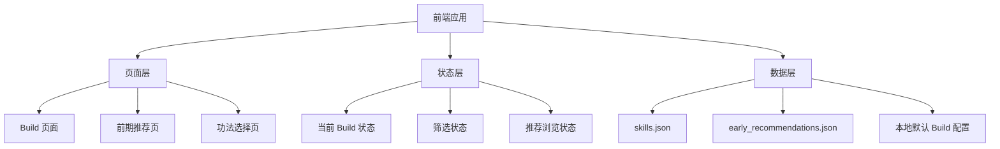
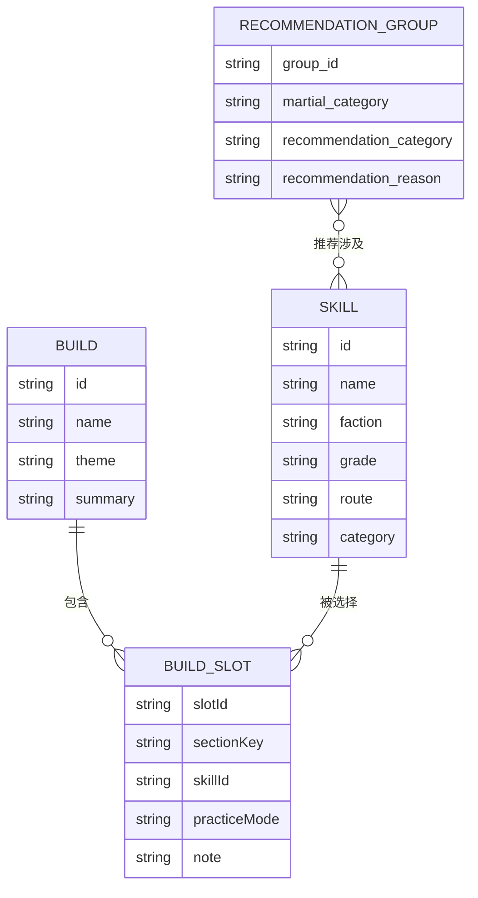

## 1. 架构设计
本项目采用纯前端本地架构，不依赖后端服务。应用启动后直接读取本地 JSON 数据源，在浏览器内完成 Build 状态管理、推荐浏览、筛选检索和 tooltip 渲染。



## 2. 技术说明
- 前端：React 18 + TypeScript + Vite
- 样式：Tailwind CSS 3 + 自定义 CSS 变量 + 少量手写动画
- 状态管理：React Context + useReducer
- 数据来源：本地静态 JSON
- 初始化方式：Vite
- 部署形态：静态 HTML 产物，可直接本地打开或用任意静态服务器预览

## 3. 路由定义
| 路由 | 用途 |
|-------|---------|
| / | Build 主页面，展示 Build 列表、示例 Build、五大栏位编排区 |
| /recommendations | 前期推荐功法结构化浏览页 |
| /skills | 功法选择页，支持筛选和加入当前 Build |

## 4. API 定义
本项目首版不提供后端 API，所有数据来自本地静态文件。

```ts
type SkillPracticeMode = "正练" | "逆练";

type SkillRecord = {
  id: string;
  name: string;
  href?: string;
  faction: string | null;
  grade: string | null;
  route: string | null;
  category: string | null;
  shape: string | null;
  practice_effects: {
    title: string;
    effect: string;
  }[];
  paragraphs: string[];
  bullet_lists: string[][];
  raw_text: string;
};

type RecommendationGroup = {
  group_id: string;
  martial_category: string;
  recommendation_category: string;
  skill_ids: string[];
  skill_names: string[];
  recommendation_reason: string;
};

type BuildSlot = {
  slotId: string;
  skillId: string | null;
  practiceMode: SkillPracticeMode;
  note?: string;
};

type BuildSectionKey = "内功" | "摧破" | "轻灵" | "护体" | "奇窍";

type BuildRecord = {
  id: string;
  name: string;
  theme: string;
  summary: string;
  sections: Record<BuildSectionKey, BuildSlot[]>;
};
```

## 5. 服务端架构图
本项目无服务端，首版留空。

## 6. 数据模型
### 6.1 数据模型定义


### 6.2 数据定义说明
- `skills.json`：功法主库，作为 tooltip、筛选与 Build 选择的单一事实来源
- `early_recommendations.json`：前期推荐结构化数据，用于推荐页和推荐入口提示
- `default_builds.json`：首版新增的默认 Build 数据，至少包含一个“刀剑乱舞 Build”示例
- `localStorage`：保存用户新建的 Build、当前编辑状态和上次选中的 Build

## 7. 页面实现策略
- Build 页面：
  - 左侧使用固定宽度 Build 列表
  - 右侧以五大类功法槽位构成主编排区
  - 每个功法卡片支持切换正练/逆练、查看 tooltip、移除功法
- 前期推荐页：
  - 顶部双层筛选：武学分类 + 推荐分类
  - 每个推荐组展示功法 chips + 推荐理由
  - 功法 chips 悬浮时展示仿 wiki tooltip
- 功法选择页：
  - 支持关键字、门派、武学分类、品阶、内力路线筛选
  - 从 Build 页面带入当前目标栏位
  - 选择后返回 Build 页面并写入当前槽位

## 8. 默认示例 Build
- 默认提供一套“刀剑乱舞 Build”
- 它不是自动算出来的最优解，而是用于演示 UI 的结构化样板
- 示例 Build 应强调：
  - 刀法/剑法摧破联动
  - 高频释放与气势周转
  - 至少展示内功、摧破、轻灵、护体、奇窍各自的配置意义

## 9. 风险与约束
- 当前数据来自 tooltip 级别信息，适合做展示与组合，不足以直接做严格数值模拟
- 推荐页正文中有少量“理由里提到其他功法”的情况，首版只将主推荐功法作为推荐组成员
- Tooltip 需要尽量模仿 wiki 观感，但交互要适应本地 HTML 页面，不直接复刻 wiki DOM
