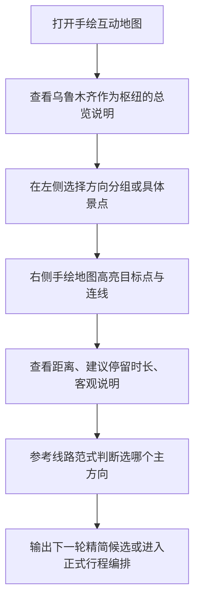

## 1. 产品概述
这是一个面向“乌鲁木齐做枢纽，向新疆周边放射游玩”的单文件互动 HTML，用手绘地图风格替代传统列表卡片，帮助用户先建立方向感，再筛选想去的板块与景点。
- 解决的问题：现有候选页更像景点清单，缺少“这些地方分别在哪、彼此远不远、通常怎么串起来”的空间关系表达。
- 目标价值：让用户在 1 分钟内看懂“乌鲁木齐周边 7 天游到底该选伊犁、北疆、吐鲁番还是轻松近郊”，并快速进入后续行程选择。

## 2. 核心功能
### 2.1 功能模块
1. **手绘总览页**：用新疆草图底图表达乌鲁木齐与周边方向关系。
2. **景点清单侧栏**：按方向分组展示重点点位、建议停留时长、距乌鲁木齐大致距离。
3. **线路范式区**：展示同事实测/常见玩法的线路骨架。
4. **互动联动**：左侧点选景点后，右侧高亮、定位、展示距离与关系线。

### 2.2 页面详情
| 页面名称 | 模块名称 | 功能描述 |
|-----------|-------------|---------------------|
| 手绘总览页 | 顶部说明区 | 简述“乌鲁木齐做枢纽”的玩法，突出 7 天游只建议选 1 个主方向 |
| 手绘总览页 | 方向筛选 | 按“市区 1-2 天 / 天池南山 / 吐鲁番 / 伊犁 / 北疆深度 / S101”切换显示 |
| 手绘总览页 | 景点清单侧栏 | 每个点位显示名称、类型、距乌鲁木齐大致公里数、建议玩法 |
| 手绘总览页 | 手绘地图画布 | 用拟手绘路径、圆点、箭头、距离标注表达相对位置与关系 |
| 手绘总览页 | 点位详情浮层 | 点击点位后显示客观介绍、主观建议、外跳地图搜索链接 |
| 手绘总览页 | 线路范式区 | 展示“伊犁环线 / 北疆深度 / 轻松版”三种典型走法 |

## 3. 核心流程
用户先看方向总览，理解大致空间关系；再点选某个方向或景点；地图立即高亮对应位置与相关连接线；随后查看对应线路范式，决定下一轮精简筛选。

## 4. 用户界面设计
### 4.1 设计风格
- 主视觉：纸张、铅笔、蜡笔、旅行手账感，不追求精确 GIS，而强调“方向感 + 大致距离”
- 主色：纸张米白、铅笔灰、靛蓝、赭石、草原绿
- 按钮风格：圆角手写标签、轻微歪斜、仿贴纸 hover
- 字体建议：标题使用有手写感或海报感中文字体，正文使用清晰的中文衬线/人文字体
- 布局风格：左侧信息栏 + 右侧大地图，桌面优先，移动端上下布局
- 图标风格：手绘 pin、箭头、路书线条、便签贴纸

### 4.2 页面设计概览
| 页面名称 | 模块名称 | UI 元素 |
|-----------|-------------|-------------|
| 手绘总览页 | 顶部说明区 | 像旅行手账首页，包含标题、短说明、方向提示 |
| 手绘总览页 | 方向筛选 | 手绘胶带标签、选中后变色并带纸张阴影 |
| 手绘总览页 | 景点清单侧栏 | 卡片像便签纸，显示名称、公里数、板块标签 |
| 手绘总览页 | 手绘地图画布 | SVG 路径、虚线关系、距离标注、区域块注释 |
| 手绘总览页 | 点位详情浮层 | 便签弹层，含地图外跳按钮与备注 |
| 手绘总览页 | 线路范式区 | 三张路线草图卡，突出“通常怎么走” |

### 4.3 响应式
- 桌面优先：左栏固定宽度，右侧地图占主要面积
- 平板：左栏可折叠，地图保留主要交互
- 手机：改为上下布局，景点清单先于地图，点击后滚动到地图高亮位置

