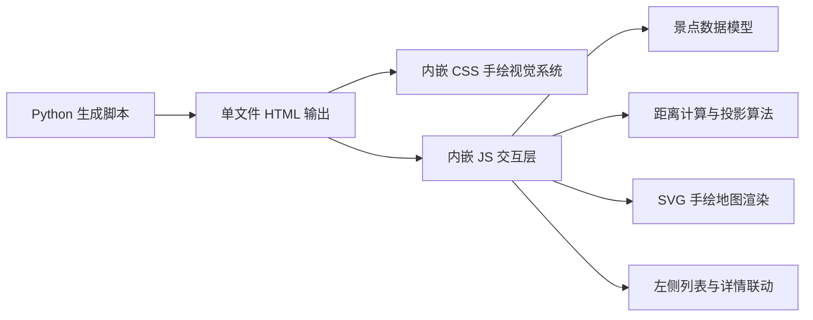
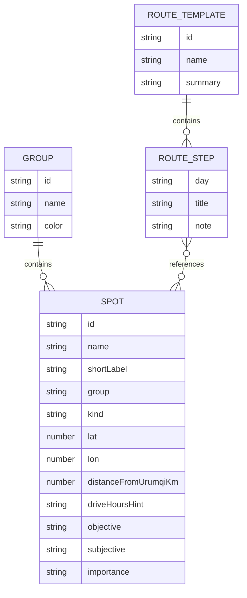

## 1. 架构设计


## 2. 技术描述
- 生成方式：Python 3 脚本生成单文件 HTML
- 前端实现：原生 HTML + CSS + JavaScript
- 地图表现：自定义 SVG 草图地图，不依赖在线瓦片服务
- 交互方式：原生 DOM 事件 + CSS 动画
- 数据来源：当前候选景点数据 + 关键点经纬度 + 线路范式摘要

## 3. 页面定义
| 路径 | 用途 |
|-------|---------|
| `/` | 单文件互动页面，展示新疆周边方向关系、重点景点、距离关系和线路范式 |

## 4. API 定义
本方案无后端 API。

前端内部数据结构：

```ts
type Spot = {
  id: string;
  name: string;
  shortLabel: string;
  group: string;
  kind: string;
  query: string;
  lat?: number;
  lon?: number;
  distanceFromUrumqiKm?: number;
  driveHoursHint?: string;
  objective: string;
  subjective: string;
  importance: "core" | "optional";
};

type RouteTemplate = {
  id: string;
  name: string;
  summary: string;
  steps: Array<{
    day: string;
    title: string;
    spots: string[];
    note: string;
  }>;
};
```

## 5. 数据模型
### 5.1 数据模型定义


### 5.2 渲染与交互规则
- 使用已有经纬度数据作为主坐标；缺失坐标的点不绘制到主地图中心层，只出现在列表和详情中，并标记为“需补坐标”
- 通过简单投影把新疆重点点位映射到 SVG 画布，保持相对方向正确，不追求真实边界精度
- 以乌鲁木齐为锚点，计算与各景点的直线粗略距离，用于列表中的“距乌市约 X km”
- 关系线分两类：
  - 放射线：乌鲁木齐到各大方向核心点
  - 线路线：同一条典型线路中的相邻点位
- 点击左侧景点时：
  - 高亮对应点位
  - 显示从乌鲁木齐到该点的距离
  - 若属于某条线路，顺带高亮该线路段
  - 右侧详情浮层展示介绍、建议、地图外跳

## 6. 输出与文件策略
- 输出文件：`travel-planner/outputs/Trip_Sketch_Map_Urumqi_Xinjiang.html`
- 保持单文件结构，便于本地复制路径后直接用 Chrome 打开
- 页面顶部提供“复制本地文件路径 / 复制目录”按钮，沿用当前项目交付习惯

## 7. 风险与处理
- 风险 1：景区/线路类点位不适合精确 geocode  
  处理：继续用人工校准经纬度或代表点坐标，不依赖在线地理编码
- 风险 2：用户误把草图地图当精确导航地图  
  处理：顶部明确标注“这是方向与距离关系图，不替代导航”；导航仍走高德外跳
- 风险 3：7 天游范围过大，点位过多会再次失焦  
  处理：默认只展示核心点，次级点通过开关展开

